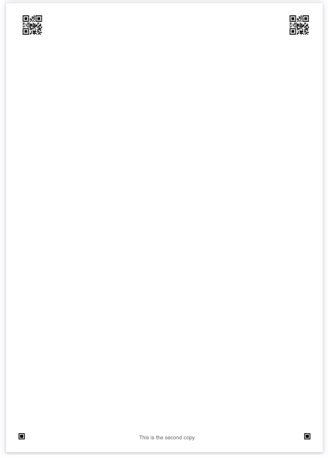

# Python PDF Overlay (Prototype)

This repository contains a prototype to add custom elements as overlays (such as markers or text) to an existing PDF template.
For one, it can be used to generate customized questionaires.


## Setup
```bash
pip install PyPDF2 reportlab
```

## Usage

```bash
python3 overlay.py -t <pdf-template.pdf> -c <config.json> -o <out.pdf> --append
```

The example creates two copies:

```bash
python3 overlay.py -t blank.pdf -c example.json -o out.pdf
```

This results in the following output:




## Configuration

As of now, the configuration is pretty limited but should be easily extendable. It also supports an array, meaning that it allows batch processing of the same template. Pages without a corresponding template page will use a blank page.

```json
{
    "pages":
        [
            {
                "elements":
                    [
                        {
                            "type": "text",
                            "options": {}
                        }
                    ]
            }
        ]
}
```